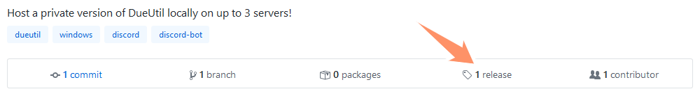
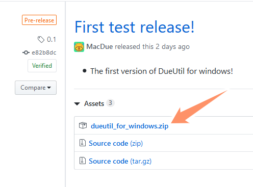
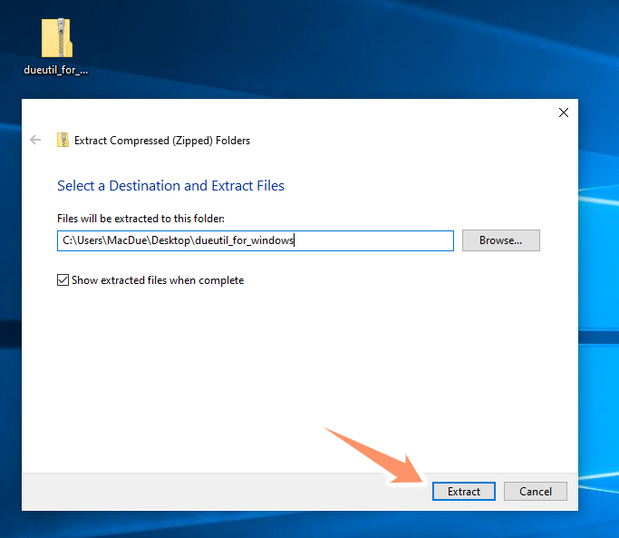
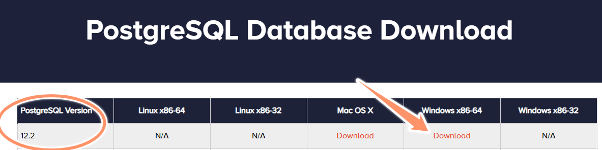
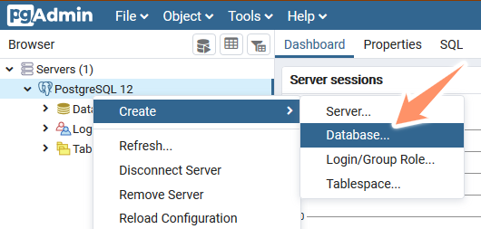
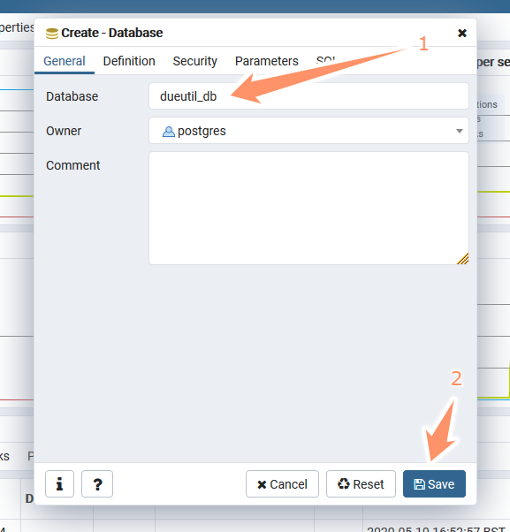
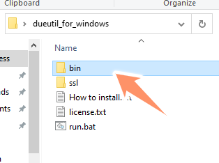
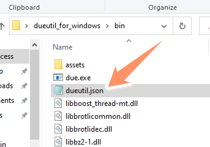
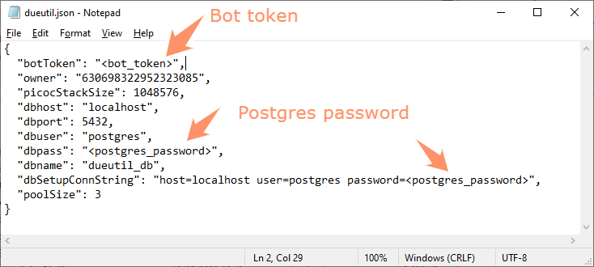
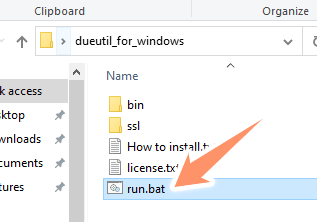

# DueUtil-for-Windows
Host a private version of [DueUtil](https://dueutil.tech/) locally on up to 3 servers!

## Setup

Head over to the [releases tab](https://github.com/DueUtil/DueUtil-for-Windows/releases).  

Find the latest version and download the ``dueutil_for_windows.zip``  

Extract that zip somewhere. The desktop is fine.  

Now before you can run the bot you've got to setup Postgres. Head to [this page](https://www.enterprisedb.com/downloads/postgres-postgresql-downloads) and download the Windows x86-64 installer.  
Don't change any of the defaults (unless you know what they mean) and make note of the password you've picked. You'll need it later.  

Now head over to the start menu and search for pgAdmin. Expand the servers view and right click "Postgres 12" then Create > Database.  

Create a database called "dueutil_db".  

Now back in the ``dueutil_for_windows`` folder you extracted earlier open the ``bin`` folder.  

Inside bin edit ``dueutil.json``  

Insert the bot token and your Postgres password in the places indicated.

You're done! Double clicking ``run.bat`` should launch the bot!  

